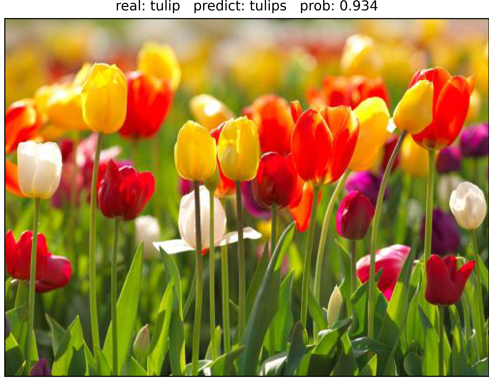

# Image Classification Models
## 1. 项目描述
通过`Pytorch`实现**主流的图像分类模型**如下：
- [AlextNet](https://github.com/codecat0/CV/blob/main/Image_Classification/models/alexnet.py)
- [VGGNet](https://github.com/codecat0/CV/blob/main/Image_Classification/models/vggnet.py)
- [GoogLeNet](https://github.com/codecat0/CV/blob/main/Image_Classification/models/googlenet.py)
- [ResNet](https://github.com/codecat0/CV/blob/main/Image_Classification/models/resnet.py)
- [DenseNet](https://github.com/codecat0/CV/blob/main/Image_Classification/models/densenet.py)
- [MobileNetV2](https://github.com/codecat0/CV/blob/main/Image_Classification/models/mobilenetv2.py)
- [MobileNetV3](https://github.com/codecat0/CV/blob/main/Image_Classification/models/mobilenetv3.py)
- [ShuffleNetV1](https://github.com/codecat0/CV/blob/main/Image_Classification/models/shufflenetv1.py)
- [ShuffleNetV2](https://github.com/codecat0/CV/blob/main/Image_Classification/models/shufflenetv2.py)
- [GhostNet](https://github.com/codecat0/CV/blob/main/Image_Classification/models/ghostnet.py)

## 2. 代码结构
```
|--models ：各个模型pytorch实现代码
|   |--alexnet.py
|   |--vggnet.py
|   |--googlenet.py
|   |--resnet.py
|   |--densenet.py
|   |--mobilenetv2.py
|   |--mobilenetv3.py
|   |--shufflenet.py
|   |--shufflenetv2.py
|   |--ghostnet.py
|   |--base_model.py : 基模型
|--utils ：配置文件
|   |--data_utils.py ：数据预处理配置
|   |--train_val_utils.py : 模型训练配置
|--train.py: 训练脚本
|--predict.py: 预测脚本
```

## 3. 数据集
**花分类数据集下载地址:** [http://download.tensorflow.org/example_images/flower_photos.tgz](http://download.tensorflow.org/example_images/flower_photos.tgz)
## 4. 环境配置
```
numpy==1.21.2
torch==1.9.1
torchvision==0.11.1
pillow==8.3.1
opencv-python==4.5.4.58
scipy==1.7.2
matplotlib==3.4.3
tqdm==4.62.3
```

## 5. 效果展示
下图为**ResNet34**的预测结果:



## 6. 训练自己的数据集
1. 数据集的准备
   - 每一个文件夹对应于一个类别的图像文件
     - 以花分类数据集为例：
          ```
          |--flower_photos
          |     |--daisy
          |     |--dandelion
          |     |--roses
          |     |--sunflowers
          |     |--tulips
          ```
2. 运行`train.py`开始训练模型：
    - 必须修改的参数：`num_classes`和`data_path`分别对应你的数据集类别数以及路径
    - 可选修改的参数：`model_name`对应你要训练哪个图像分类模型

3. 训练结果预测
   - `model_weight_path`指向训练好的权重文件
   - `model_name`表示使用哪一个模型进行预测，对应于上面的权重文件
   - 修改后就可以运行`predict.py`进行预测了
    