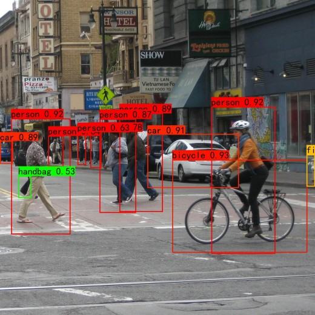

# YOLOV5算法
## 1. 项目描述
**相对于YOLOV4改进的部分**
1. 主干提取网络：增加了`Focus结构`
2. 对于任何一个真实框，不再使用iou进行正样本的匹配，而是直接采用高宽比进行匹配
3. 每个真实框不仅由其中心点所在的网格内的左上角特征点来负责预测，同时还有其中心点最近的两个网格负责预测

## 2. 代码结构
```angular2html
|--dataset
|    |--data_utils.py ：数据处理配置文件
|    |--dataset.py ：YOLO数据集操作
|--nets
|    |--CSPdarknet.py : CSPDarkNet-53网络
|    |--yolo.py : YOLOV4网络
|--utils
|    |--box_utils.py : 用于将预测结果转为真实框box的操作
|    |--loss_utils.py : YOLOV4网络计算损失
|    |--train_utils.py : 训练相关配置
|    |--callbacks.py : 记录日志相关操作
|--model_data
|    |--train.txt ： 训练时使用，每行包含训练图片路径，每张图片中gtbox的位置以及对应的类别
|    |--val.txt ： 验证时使用，每行包含验证图片路径，每张图片中gtbox的位置以及对应的类别
|    |--coco_classes.txt : 类别文件，每行对应一个类别
|    |--yolo_anchors.txt : YOLO中anchor的大小 
|    |--simhei.ttf : 字体文件
|--voc_annotations.py : 用来生成model_data下的train.txt和val.txt
|--train.py : 训练脚本
|--predict.py : 预测脚本
```
## 3. 数据集
   - **COCO数据下载地址：** [https://cocodataset.org/#home](https://cocodataset.org/#home)

## 4. 环境配置
```
numpy==1.21.2
torch==1.9.1
torchvision==0.11.1
pillow==8.3.1
opencv-python==4.5.4.58
scipy==1.7.2
matplotlib==3.4.3
tqdm==4.62.3
```

## 5. 模型效果展示


## 6. 训练自己的模型
1. 数据集的准备
   - 训练前将标签文件放在VOCdevkit文件夹下的VOC2007文件夹下的Annotation中。路径对应于`.gitignore`文件的第2行
   - 训练前将图片文件放在VOCdevkit文件夹下的VOC2007文件夹下的JPEGImages中。路径对应于`.gitignore`文件的第2行

2. 数据集的处理
   在完成数据集的摆放之后，我们需要利用voc_annotation.py获得训练用的train.txt和val.txt。**注意修改classes_path**

3. 开始网络训练
   **注意修改classes_path**，运行`train.py`即可
4. 训练结果预测
   - `model_path`指向训练好的权值文件
   - `classes_path`指向检测类别所对应的txt
   - 修改后就可以运行`predict.py`进行检测了

