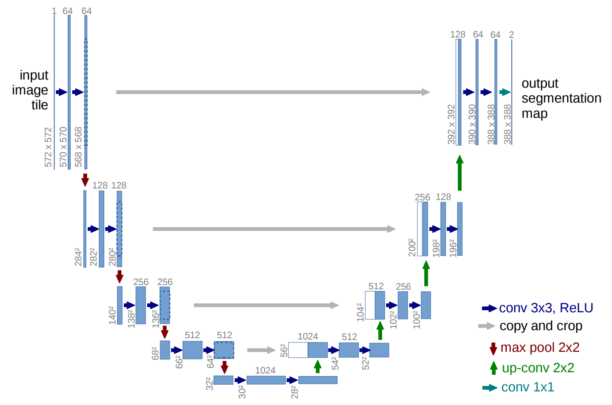

# U-Net算法
## 1. 项目描述
- 通过Pytorch简单实现了[U-Net: Convolutional Networks for Biomedical Image Segmentation](https://arxiv.org/abs/1505.04597)

## 2. 代码结构
```angular2html
|--dataset
|   |--dataset.py：pspnet数据集操作
|   |--utils.py：数据处理配置文件
|--nets
|   |--vgg.py：vgg16特征提取主干网络
|   |--unet.py：UNet网络
|--utils
|   |--callbacks.py：记录日志相关操作
|   |--loss_utils.py：损失函数
|   |--metrics_utils.py：评价指标相关
|   |--train_utils.py：训练相关配置
|--train.py：训练脚本
|--predict.py：预测脚本
|--get_miou.py：计算模型mIoU
```

## 3. 数据集
   - **VOC数据下载地址：** [http://host.robots.ox.ac.uk/pascal/VOC/](http://host.robots.ox.ac.uk/pascal/VOC/)

## 4. 环境配置
```angular2html
numpy==1.21.2
torch==1.9.1
torchvision==0.11.1
pillow==8.3.1
opencv-python==4.5.4.58
scipy==1.7.2
matplotlib==3.4.3
tqdm==4.62.3
```

## 5. 模型效果展示


## 6. 模型架构
